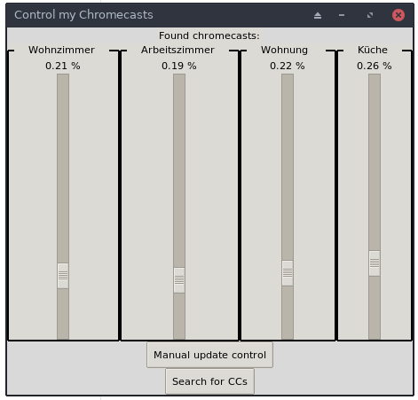

### GUI for Chromecast Volumecontrol

Control the volume of your chromecasts through this little gui on your computer of choice, not through the awful google home app. Based on top of the awesome [pychromecast](https://github.com/balloob/pychromecast) lib.

App listens to changes of volume through other apps (e.g. google home) and adjusts sliders.

Tested with chromecast audios only, i do not have others.

## Run it

##### Requirements:
TK Python library:

`sudo apt install python3-tk`

##### PIP
install it from [pypi](https://pypi.org/project/chromecast-volumecontrol/)

`pip install chromecast-volumecontrol`

then, you can use run 

$ cc_volumecontrol` 

to open the gui 

##### Clone it
Clone and run gui.py, not yet more available, still under development. Dependencies are python3 and pychromecast.

## Future
Add REST interface for IOT devices controlling the volume via hardware sliders. They could communicate with
some endpoint. Currently, flask_endpoint.py is used to allow for some testing e.g. using arduinos with wifi.

