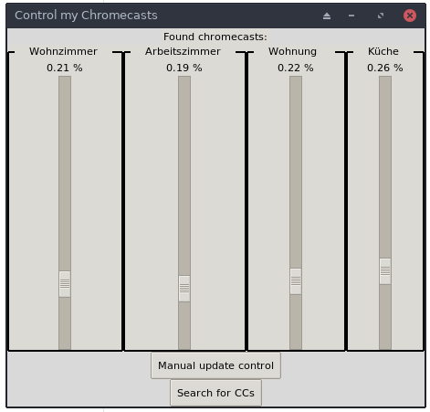

### GUI for Chromecast Volumecontrol

Control the volumeof your chromecasts through this little gui. Based on top of the awesome [pychromecast](https://github.com/balloob/pychromecast) lib.

App listens to changes of volume through other apps (e.g. google home) and adjusts sliders.

## Future
Add REST interface for IOT devices controlling the volume via hardware sliders. They could communicate with
some endpoint. Currently, flask_endpoint.py is used to allow for some testing e.g. using arduinos with wifi.

## Installation
Clone and run, not yet more available still under development. Dependencies are python3 and pychromecast.

